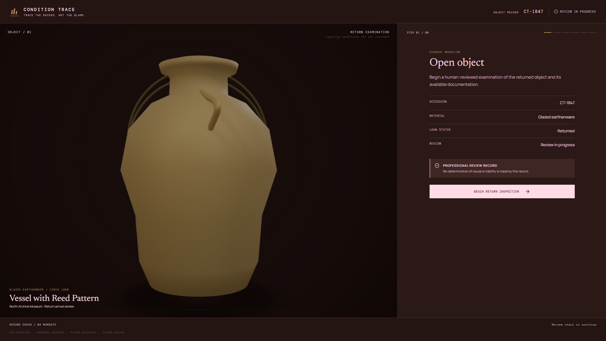
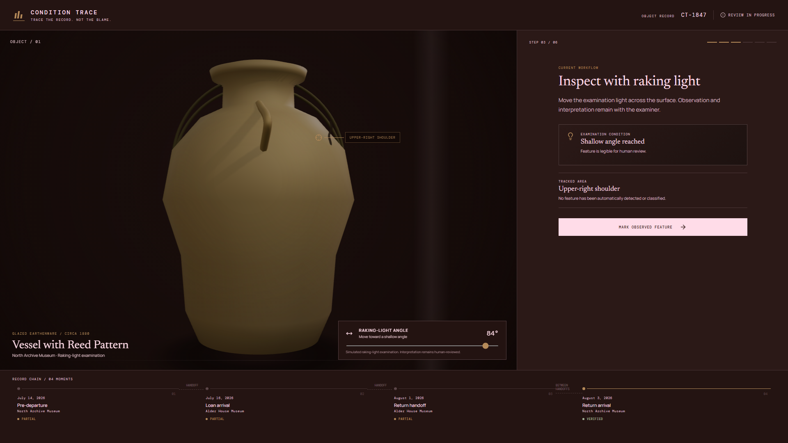
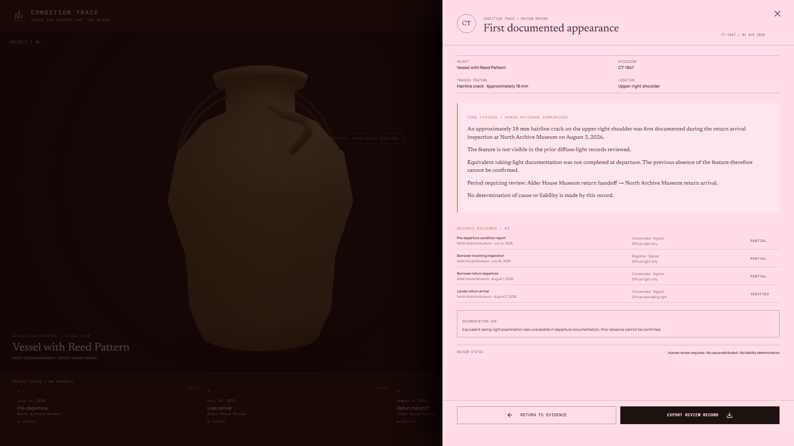
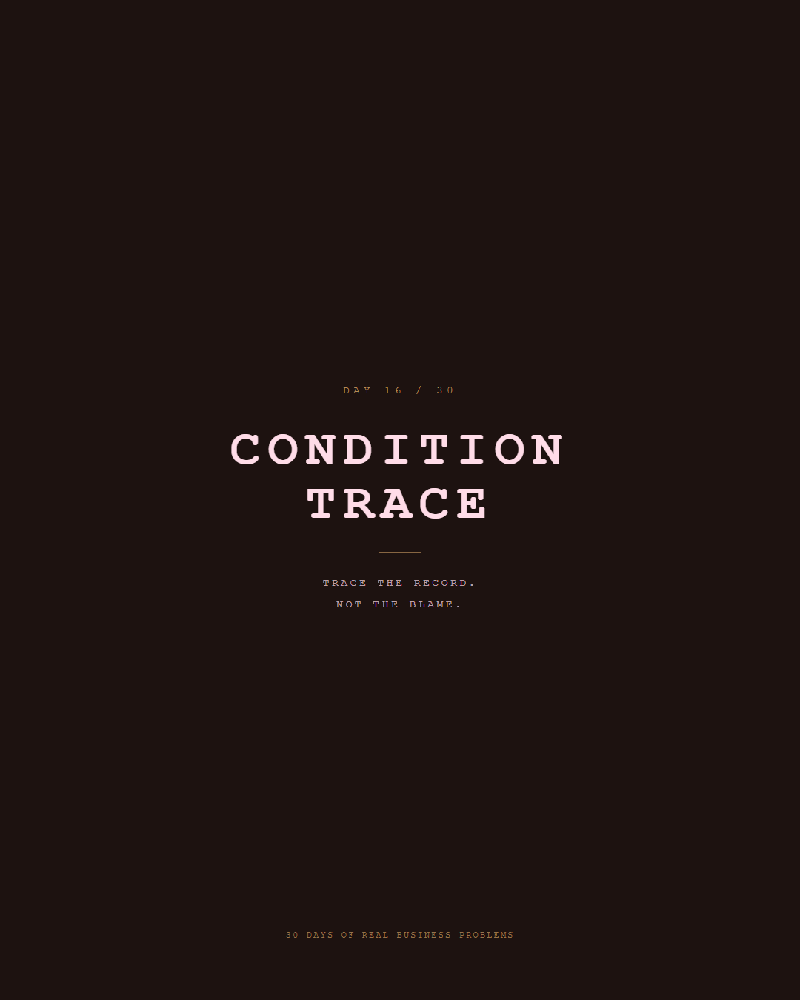

# Condition Trace

**Day 16 of 30 Days of Real Business Problems — Phase II**

> **Trace the record. Not the blame.**

Condition Trace is a conservation-evidence prototype for reviewing when a surface feature first becomes documented across a chain of non-equivalent museum records.

## Live demo

**Production:** https://day16-condition-trace.vercel.app

**Current promoted direction:** **Evidence in Motion V4** on `main`.

The product does **not** determine where damage occurred, when it physically occurred, who caused it, or who is liable. It preserves the narrower claim the evidence can support: **first documented appearance**.

---

## The reframe

A condition report tells us what was documented under a particular examination setup.

That is not the same as proving physical absence before that record.

So the product reframes the question:

> **Do not trace where the damage occurred. Trace when the feature first appears in the documentation record.**

Canonical conclusion:

- **First documented appearance:** Aug 3, 2026
- earlier records were made under diffuse light;
- the Aug 3 return examination adds raking light;
- those examinations are therefore not equivalent;
- prior physical absence cannot be confirmed;
- no determination of cause, exact physical timing, responsibility, or liability is made.

---

## Evidence in Motion V4

V4 treats evidence as something that stays visually continuous through the workflow instead of resetting on every screen.

### Core interaction laws

1. **Evidence has continuity**  
   The captured observation persists from inspection into comparison, finding, and final record.

2. **Light is the instrument**  
   Raking light is the hero examination mechanism. The user changes the grazing angle until the upper-right shoulder feature becomes legible.

3. **Evidence has resistance**  
   Finalization is not a decorative click. The record uses a deliberate hold-to-seal interaction before closure.

4. **Archive closes the loop**  
   The captured observation resolves into a final evidence record rather than disappearing into a generic success state.

### Canonical workflow

```text
Open → Records → Inspect → OBS-04 → Compare → Finding → Record
```

Evidence lineage:

```text
SRC-03 → OBS-04 → CMP-01 → LIM-01 → FND-01
```

---

## Visual walkthrough

### 01 — Open



### 02 — Raking-light reveal



### 03 — Evidence Record



### Social cover



Additional capture assets live in `submission-video/screenshots/`.

---

## Product contract

Fictional object:

- **Vessel with Reed Pattern**
- accession **CT-1847**
- glazed earthenware, circa 1880
- tracked feature: hairline crack, upper-right shoulder, approximately 18 mm

Four record moments:

1. **Jul 14, 2026 — Pre-departure**  
   Diffuse light. Feature not visible. Partial.

2. **Jul 16, 2026 — Borrower incoming**  
   Diffuse light. Feature not visible. Partial.

3. **Aug 1, 2026 — Borrower return departure**  
   Diffuse light. No equivalent raking-light examination. Partial.

4. **Aug 3, 2026 — Lender return arrival**  
   Diffuse + raking light. Feature observed. Verified.

The raking-light observation is preserved as **OBS-04** and carried into the evidence chain.

---

## What the interface deliberately refuses to claim

- automatic crack detection;
- a confidence score;
- physical cause;
- exact moment of damage;
- where damage occurred;
- responsibility or liability.

Preferred language:

- **First documented appearance**
- **Feature not visible**
- **Equivalent examination unavailable**
- **Documentation gap**
- **Period requiring review**
- **Human-reviewed comparison**

Canonical limitation:

> No determination of cause or liability is made by this record.

---

## Technology

- React
- TypeScript
- React Three Fiber / Three.js
- Framer Motion / Motion
- Anime.js
- Playwright for deterministic visual QA
- Remotion tooling for showcase-film production

V4 implementation includes:

- evidence continuity across screens;
- real raking-light examination interaction;
- OBS-04 capture continuity;
- comparison-state carry-through;
- animated evidence lineage;
- Finding → Record collapse;
- physical hold-to-seal finalization;
- reduced-motion support;
- deterministic browser QA capture.

---

## Phase II release

Condition Trace is the first project released after the break in **30 Days of Real Business Problems**.

The Phase II return film uses the project as the proof point for the new rule:

> **I changed how I build — and this is the first evidence.**

The social film combines the Phase II return sequence with a real Condition Trace V4 workflow capture and narration. The repository remains the source of truth for product behavior; social assets are presentation artifacts.

---

## TRACE design workflow

Condition Trace is also a proving ground for the reusable **TRACE** design-assurance workflow:

- **T — Truth**
- **R — Research & References**
- **A — Art Direction & Architecture**
- **C — Character & Construction**
- **E — Evaluation & Evolution**

Current documentation:

- [`docs/V4_EVIDENCE_IN_MOTION.md`](docs/V4_EVIDENCE_IN_MOTION.md) — current V4 design and interaction contract.
- [`docs/UIUX_WORKFLOW_CANONICAL.md`](docs/UIUX_WORKFLOW_CANONICAL.md) — canonical design gates and anti-slop rules.
- [`docs/TRACE_WORKFLOW_SYSTEM.md`](docs/TRACE_WORKFLOW_SYSTEM.md) — TRACE architecture.
- [`docs/DAY16_AGENT_HANDOFF.md`](docs/DAY16_AGENT_HANDOFF.md) — current continuation state.
- [`docs/VIDEO_DEMO_GUIDE.md`](docs/VIDEO_DEMO_GUIDE.md) — original showcase strategy.
- [`docs/POSTMORTEM_CONDITION_TRACE_V3.md`](docs/POSTMORTEM_CONDITION_TRACE_V3.md) — archived V3 post-mortem.
- [`docs/V3_CHANGELOG.md`](docs/V3_CHANGELOG.md) — archived V3 implementation history.

---

## Run locally

```bash
npm install
npm run dev
```

Production build:

```bash
npm run build
npm run preview
```

---

## Interaction walkthrough

1. Open the case.
2. Review the four source records and their evidence status.
3. Enter Inspect.
4. Move the raking-light control toward a shallow grazing angle.
5. Capture the human-reviewed observation as **OBS-04**.
6. Compare it with the earlier non-equivalent documentation.
7. Review the evidence lineage and qualified **FND-01** finding.
8. Hold to seal.
9. Resolve the chain into the final Evidence Record.

---

## Fictional data

North Archive Museum, Alder House Museum, Meridian Fine Art Logistics, the vessel, and every condition record in this prototype are fictional demonstration data.
